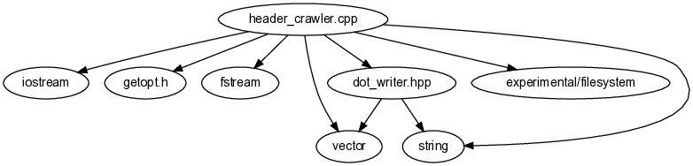

# header_crawler

https://github.com/migr95/header_crawler/actions/workflows/c-cpp.yml/badge.svg

Littel tool to generate a graph of include hierarchies using dot.

Creates a graph in PostScript which displays the include hirarchy as tree-diagram starting from a specified file. 
E.g. for this repository starting at "src/header_crawler.cpp" it produces:

## Requirements

For generating the graphs, _dot_ from Graphviz is needed. Install from [here](https://graphviz.org/download/) or by using:

	sudo apt install graphviz

## Build

Build with

	make
	
To remove build, call

	make clean
	
## Usage

Run with the following command to create graph for a specific root-file.

	./bin/header_crawler -f FILE_PATH
	
To specify further inlcude directories, _-d_ can be used.

	./bin/header_crawler -f FILE_PATH -d INCLUDE_DIR
	./bin/header_crawler -f FILE_PATH -d [INCLUDE_DIR1:INCLUDE_DIR2]
